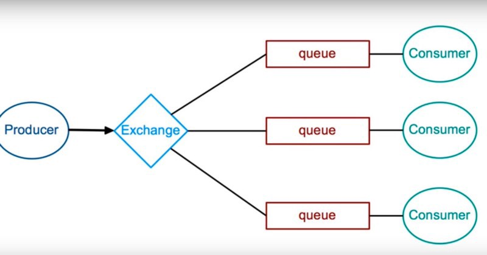

# RabbitMQ 🐰
RabbitMQ full concept with all codes, syntax and notes

* it is a messaging queue protocol library

RabbitMQ is a message broker

* It gives a platform to send and receive messages, and  messages are safe until they received by listner.



      Publisher👨  => RabbitMQ(msg broker)  => Listner👨

Installation 
```
npm install amqplib
```
use
```
var amqp = require('amqplib/callback_api');
```

## important methods

### 1. `connect`
* used to connect with rabbitmq server

```
amqp.connect(`amqp://localhost:5672`, (err, connection) =>{
     // code 
})
```


### 2. `createChannel`
* used to creating the channel

```
connection.createChannel((err1, channel) => {  
      // code
});
```


### 3. `assertQueue`
* assertQueue is an declaration of queue

```
channel.assertQueue(queue, {
      durable: false                      
})
```


### 4. `sendToQueue`
* sendToQueue is pushing your message in the queue

```
channel.sendToQueue(queue, Buffer.from(msg))
```


### 5. `sendToQueue`
* it is used for receiving the messages

```
channel.consume(queueName, (msg) => {
      console.log(`Received : ${msg.content.toString()}`)
      // channel.ack(msg);
})
```
